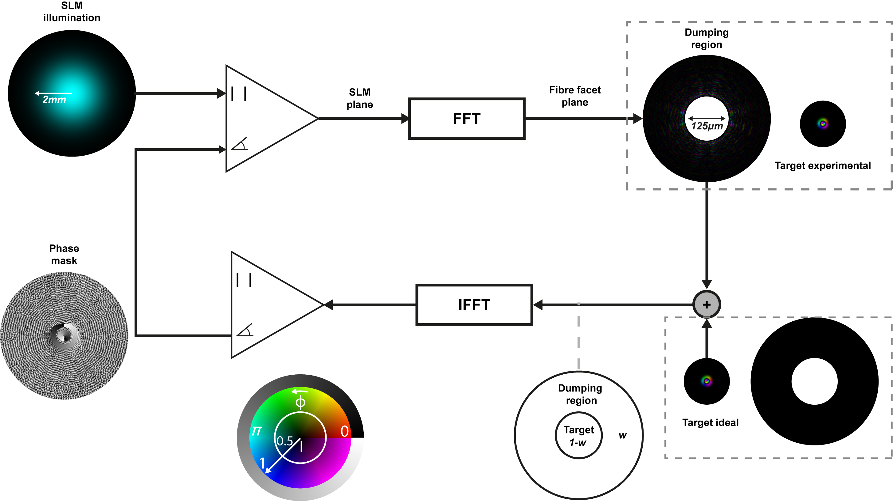

# Gerchberg–Saxton (GS) algortim for phase and amplitude light control

# Code implementations:

It works with LG mode bases. All the implementations requieres fibremodes module avaliable in my other repositories.

## modemasks.py

Used to generate LG mode phase masks libraries

## pyPhasemasks.py

Generate arbitrary phase masks fields based on LG coeficients

## pyBeamshaper.py

Used to performing beamshaping togeter and LCoS